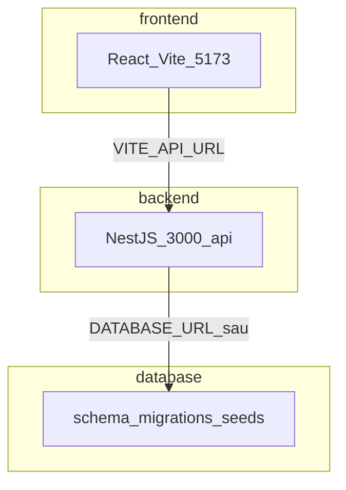

# Kiến trúc DriveGo (monorepo)

## Tổng quan



## Folder

| Folder | Trách nhiệm |
|--------|-------------|
| `frontend/` | UI, routing, copy tiếng Việt, gọi API qua `src/lib/api.js` |
| `backend/` | REST `/api/*`, auth, business logic (skeleton hiện tại) |
| `database/` | DDL, migrations, seeds — tách khỏi Nest để dễ review SQL |
| `docs/` | Spec domain, Figma map, architecture |

## Backend modules (NestJS)

| Module | Route prefix | Trạng thái |
|--------|--------------|------------|
| health | `/api/health` | Hoạt động |
| auth | `/api/auth` | Stub — chờ DB |
| users | `/api/users` | Stub |
| exams | `/api/exams` | Stub |
| schedules | `/api/schedules` | Stub |
| notifications | `/api/notifications` | Stub |
| articles | `/api/articles` | Stub |
| plans | `/api/plans` | Stub |
| lookup | `/api/lookup` | Stub |
| centers | `/api/centers` | Stub |
| chat | `/api/chat` | Stub |

## Biến môi trường

### Frontend (`frontend/.env`)

```env
VITE_API_URL=http://localhost:3000/api
```

### Backend (`backend/.env`)

```env
PORT=3000
CORS_ORIGIN=http://localhost:5173
DATABASE_URL=
JWT_SECRET=change-me
```

## Bước tiếp khi có database

1. Cung cấp loại DB + connection string.
2. Chạy `database/schema/drivego.schema.sql` hoặc migrations trong `database/migrations/`.
3. Bật TypeORM/Prisma trong Nest, implement `auth` → `exams` → `schedules`.
4. Nối `LoginPage` / `RegisterPage` với `POST /api/auth/*`.
