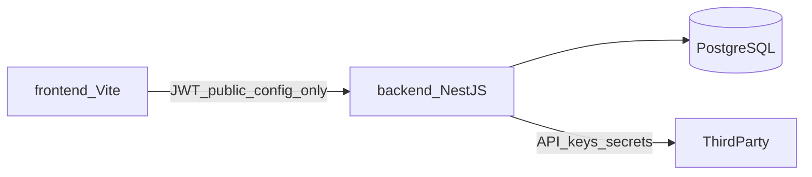

# Tích hợp third-party — DriveGo

**Có thể dùng** Firebase, cổng thanh toán, AI, email… Miễn là kiến trúc rõ: **frontend gọi backend**, backend giữ secret và gọi dịch vụ ngoài.

## Nguyên tắc



- **Không** để secret key (Momo, OpenAI, Firebase Admin) trong frontend.
- **PostgreSQL** vẫn là nguồn dữ liệu chính (học viên, đề thi, lịch thi, thanh toán).
- Third-party bổ sung: auth social, push, email, AI, payment gateway.

## Gợi ý theo tính năng UI

| Tính năng UI | Third-party phổ biến | Ghi chú |
|--------------|----------------------|---------|
| Đăng nhập Google/Facebook (nút trên Login) | Firebase Auth, Auth0, hoặc OAuth2 trực tiếp | Backend verify token → tạo JWT riêng DriveGo |
| Quên mật khẩu | Resend, SendGrid, AWS SES | Backend gửi link reset |
| Thanh toán Premium (Upgrade) | **Sepay**, Momo, ZaloPay | Backend tạo payment URL + webhook cập nhật `payments` |
| AI Chat | OpenAI, Google Gemini, Anthropic | Backend proxy — không gọi AI từ browser |
| Push thông báo | Firebase Cloud Messaging (FCM) | Optional; vẫn lưu `notifications` trong Postgres |
| Upload ảnh đề thi / avatar | Firebase Storage, AWS S3, Cloudinary | Backend signed URL |
| SMS OTP (nếu cần) | Twilio, ESMS VN | Qua backend |

## Firebase — dùng phần nào?

| Dịch vụ Firebase | Nên dùng? | Thay thế trong stack hiện tại |
|------------------|-----------|-------------------------------|
| Firebase Auth (Google/FB) | Có | Nest JWT + OAuth callback |
| Firestore | Không khuyến nghị | PostgreSQL đã có schema |
| FCM (push) | Có (optional) | — |
| Storage | Có (ảnh) | Local/S3 cũng được |

**Khuyến nghị:** Giữ **PostgreSQL + Nest JWT** làm core; Firebase chỉ cho **OAuth social login** và/hoặc **FCM** nếu cần app mobile sau này.

## Thanh toán Việt Nam

1. Frontend: user chọn gói → `POST /api/payments/checkout`
2. Backend: tạo bản ghi `payments` (status `pending`), gọi Sepay/Momo API
3. User thanh toán trên cổng → redirect về `/upgrade?status=success`
4. Webhook IPN từ cổng → backend xác minh chữ ký → `premium_until` trên `student_profiles`

Sandbox/test: mỗi cổng có merchant test — cấu hình trong `backend/.env`.

## Biến môi trường (ví dụ sau này)

```env
# backend/.env — ví dụ, chưa bật
GOOGLE_CLIENT_ID=
GOOGLE_CLIENT_SECRET=
SEPAY_MERCHANT_ID=
SEPAY_SECRET_KEY=
MOMO_PARTNER_CODE=
OPENAI_API_KEY=
FIREBASE_PROJECT_ID=
RESEND_API_KEY=
```

## Thứ tự triển khai đề xuất

1. Nest + PostgreSQL: auth, exam, history (đang làm)
2. Payment sandbox (Sepay)
3. Email reset password
4. AI Chat qua backend
5. OAuth Google/Facebook
6. FCM / Storage nếu cần

Khi bạn chọn cổng cụ thể (ví dụ Momo + Gemini), có thể implement module tương ứng trong `backend/src/modules/`.
